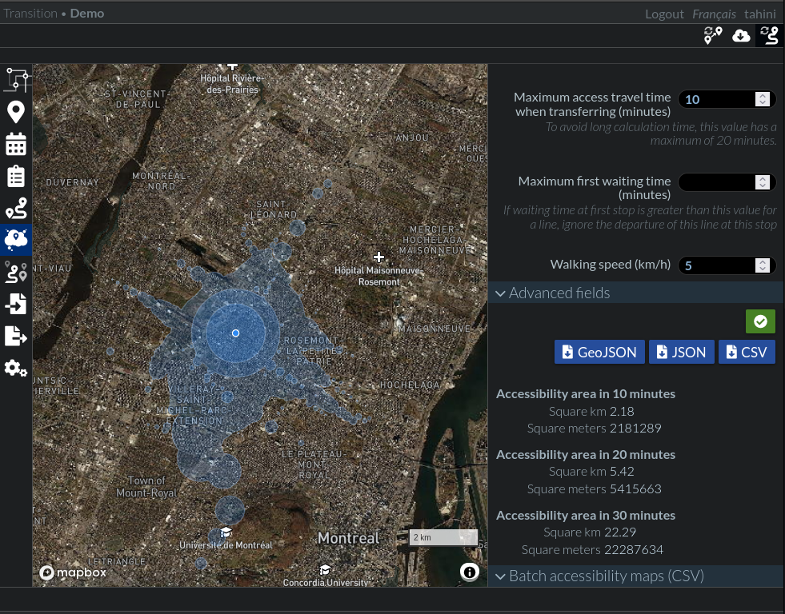
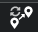
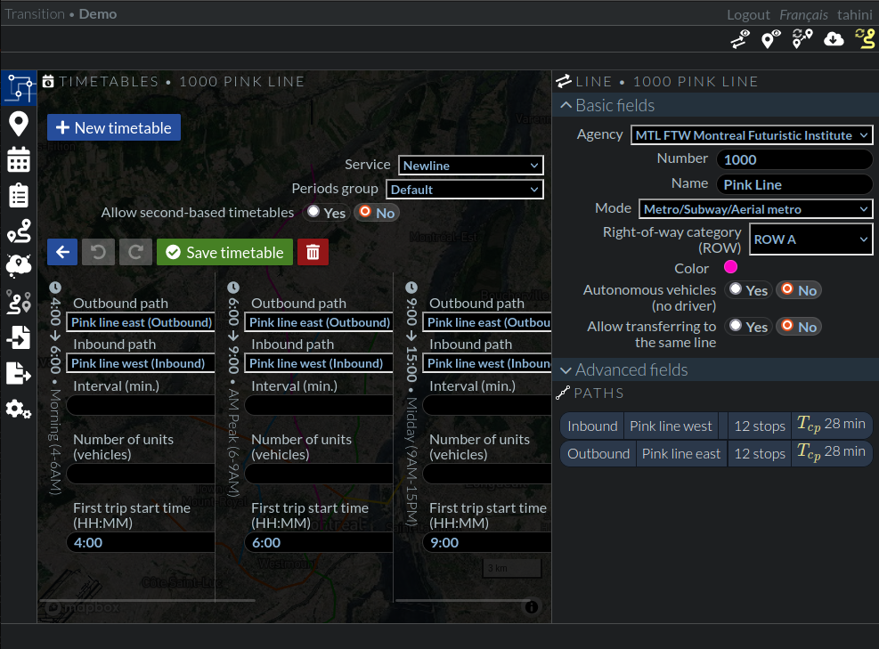

# Transition tutorial

This tutorial will guide you through the first steps of using [Transition](http://transition.city) and help you discover what can be achieved with it.

It supposes you have access to an instance of Transition, with access to a routing server (osrm) that includes the region that you want to analyze. See the [project's development page](http://github.com/chairemobilite/transition) for instructions to install Transition.

## Lesson 1: Import existing data from GTFS

[GTFS](https://gtfs.org/) is a open standard format used to distribution transit information. Most agencies in the world use this format, that can be used by various tools to show transit data to users.

Many transit feeds can be easily found in the [Open Mobility data](https://transitfeeds.com/) website, but the most up to date versions are recorded in the [Mobility Database catalogs](https://database.mobilitydata.org/). The transit agencies website may also contain this information. For example, the Montreal Transportation Society, whose data has been used to write this tutorial, can be found on [their website](https://www.stm.info/en/about/developers).

To import the GTFS, click on the `Import from a GTFS feed` menu item on the left, towards the bottom of the list. It will open the import panel.


Select the GTFS zip file that contain the data to import

Click on the upload file button 

It will then display the agencies and services available on the GTFS. Selecting an agency will display the available lines. Select the agencies and lines to import. You can click the `Select all` button to import all lines for the selected agency.


Select the services to import. Service names are not always obvious, some agencies have a lot of services. They can either all be select, or filtered to include only the services for weekdays at a given date.


If there are still many services, you may check the "Merge services for the same periods?" checkbox at the end of the service list. It will merge all the services that are for the same days and dates as one.

For the periods groups, selecting `Default` will cause the schedules to be split into 6 periods: early morning, peak AM, day, peak PM, evening and night. Transition is used for transit planning, so schedules are not meant to be fine-tuned by the minute, but rather calculated as a batch for periods. This allows to generate schedules every 15 minutes in the early morning, every 5 minutes during peak AM, etc. If periods are not important, for example, to have lines run all day every 10 minutes, then choose the `Complete day` period.


Finally, click the `Import data`. This will upload the transit data into Transition. It may take a few minutes to complete depending on the agency's size. If the import completes without error, you will be redirected to the `Agencies and lines` panel. 

If there are errors, the import tab will remain open and display the errors and warnings. They may not all result in bad routing, but may prevent correct display of involved lines. Those lines may need to be investigated with care.

*If you know that the GTFS is valid, don't hesitate to open a new issue on [the Transition github](https://github.com/chairemobilite/transition), with a description, the error message and a link the GTFS file used.*

But at this point, there should be data available in Transition!


## Lesson 2: Prepare imported data for calculations

Once the data is imported, it is available in the `Agencies and lines` panel. The `Stop nodes` will also display all the stop nodes locations imported with the data, as shown in the screenshot below.


But it is not yet ready to be used in calculations. The following steps will prepare the newly imported data so that we can simulate and analyze it.

### Create scenario

A scenario in Transition represents a transit network, a state of the transit offer, for a certain date. It can group many services, from many agencies. It can also include only or exclude some data (lines, modes, etc). All calculations (routing, accessibility maps, etc) are made against a scenario.

To create a new scenario, click on the `Scenarios` menu item on the left. It will open the `Scenarios` panel.


Then click on the `New scenario` button. Give a name for this scenario.

Then select the services to include in this scenario. If the services were filtered at import, you may select them all, otherwise, only the services for the day to test should be selected. All trips for the selected services will be used for routing, so mixing weekday and weekend services will artificially increase the offer!


The map shows the lines that are part of this scenario. Also, they are listed at the bottom of the panel, after the actions buttons.


Click on the save button  to save the scenario.

### Refresh calculation data

Some data needs to be pre-calculated, to avoid lengthy calculations. When the transit data has been edited and is ready for calculation, do the following steps:

1. Refresh the transferrable nodes: The walking distance from each nodes to all other nodes is calculated (up to a max of 20 minutes). This is used to determine possible transfer times and distances during a trip.

2. Save data to cache for the routing engine: Transition uses [trRouting](https://github.com/chairemobilite/trRouting) as the routing engine. `trRouting` reads its data from a cache that needs to be manually updated when there are changes to the transit data in Transition.

3. Start the routing engine: By default, when the instance starts, the routing engine is not running. It needs to be manually started. 

Usually, the icons will be yellow when there are un-processed data and will turn white once it the action has been executed. The following screenshot shows the buttons for each step. *These manual steps are error prone and we are working to make them automatic.*


The data is now ready for calculation!

## Lesson 3: Test the imported data by calcuting routes

When changes are done on a scenario, before doing lengthy calculations on it, it is important to test that it works as expected and give logical results. This can be done by testing some trip calculations on the transit network.

Navigate to the `Routing` panel, by clicking on the `Routing` in the left menu.


You can fine-tune the parameters, to change the departure/arrival time, maximum travel time, minimum waiting time, maximum access, egress and transfer time.

Then select the scenario to test and whether you want alternatives or not.

To define the origin and destination, you may simply click on the map. The first click will define the origin, all further clicks will change the destination.

To change the origin again, right-click on the map. A popup menu will open and allow to select the origin or destination for the current point localtion.

Finally, click on the  calculation button and you should see the result of the route display on the map.


When selecting results with alternatives, you can navigate through the alternatives to see the detailed results for each.


### Troubleshooting routing

The routing engine returns no result? 

If there is no access, either at origin or destination (no stop nodes near those points), or if there is no service at origin or destination, the error message will be explicit enough. You can change the origin or destination for locations where there is service available.


If the message says it returned no result, it will hint to look at some parameters values. You can try changing the travel time, access/egress, etc.


If you are certain that there should be a route with the given parameters, go back to [lesson 2](#lesson-2-prepare-imported-data-for-calculations) and validate that the scenario contains the expected lines, then refresh calculation data to make sure it is up to date.

## Lesson 4: Visualize accessibility maps

Another type of calculation that can be done with the scenario is the accessibility maps. Accessility maps are isochrones displaying the region accessible in transit within a certain amount of time.

Navigate to the `Accessibility map` panel, by clicking on the `Accessibility map` in the left menu.


Many of the parameters to set are similar to those of the `Routing`. Specifying a departure time means the selected location is an origin, while an arrival time means the location is a destination.

The parameters specific to the accessibility map are the number of polygons and the delta and delta interval. The number of polygons is the number of isochrones that will be drawn. The outermost isochrone is for the maximum travel time specified. And each other isochrone is for a corresponding fraction of the total time. For example, 4 polygons with a 60 minutes total travel time will draw isochrones for 15, 30, 45 and 60 minutes.

As for the delta, it allows to flatten the variabilities at different times by calculating an average of the accessibility a bit before and a bit after the requested time. For example, with the default values of departure time at 8:00 and a delta of 10 minutes and interval of 5 minutes, it will calculate the accessibility at 7:50, 7:55, 8:00, 8:05 and 8:10. A node `n` may be accessible in 15 minutes at 7:50, 10 minutes at 7:55, 20 minutes at 8:00, 15 minutes at 8:05 and 10 minutes at 8:10. The final time for node `n` will be the average of all the times obtained (`(15 + 10 + 20 + 15 + 10) / 5 = 14` minutes), while it would have been 20 minutes if only the 8:00 calculation had been taken into account.

Select the scenario, as for the routing calculation, then click on the  calculation button and you should see the result of the route display on the map. Results may take a while to calculate. You can decrease the maximum total travel time or the number of polygons to speed things up to quickly see a first result.



### Troubleshooting accessibility maps

If there is a problem with the scenario or the selected locations, there won't be any error message, but the only isochrone displayed will be a circle of walking distance from the point, as shown in the screenshot below. That means that no transit trip could be done from this location.


It may mean that the point is outside the network zone or the time outside the service hours. Or there may be problem with the network. Make sure that `Routing` works as expected from/to this location. See [the `Routing` troubleshooting section](#troubleshooting-routing) for information to troubleshoot transit errors in calculations.

So far, we have learned how to create a scenario from a service or set of services and how to test this scenario by making single calculations on it to make sure it corresponds to what is expected. We will now learn to modify the scenarios or network and validate the results.

## Lesson 5: Edit scenarios, to remove modes or lines

We will learn to fine-tune a scenario, to remove certain modes or lines from the calculations.

Go back to the `Scenario` panel ().

We will duplicate the scenario that we created earlier, by clicking on the duplicate button  next to the scenario. This will create a scenario of the same name, with the `(copy)` suffix.


Click on this scenario to edit it. Rename it to something more explicit, for example `Test STM without metro`.

To exclude the metro, select the `Metro/Subway/Aerial metro` in the `Excluded modes` fields. You may also remove a few lines in the `Excluded lines` field.


Then click on the  save button to save this scenario.

Finally, for the new scenario to be considered, you must save the data to cache for the routing engine (step 2 of the [refresh calculation data section](#refresh-calculation-data)) by clicking on the . This will automatically restart the routing engine.

### Validate results with routing

The scenario is now ready for calculation. You can now go back to the `Routing` and `Accessibility maps` panels, select the new scenario and make sure the metro modes and excluded bus lines are not part of the transit trips anymore.


Notice that without the metro, for a very similar trip than the one calculated in [lesson 3](#lesson-3-test-the-imported-data-by-calcuting-routes), there are now 44 alternatives instead of just 3. But the first alternatives in this scenario takes *66 minutes* instead of just around 30 minutes in the original scenario. Alternatives are considered valid if they are within a factor (1.75) of the first alternative returned. So this 66 minutes trip would not have been considered as an alternative to a 30 minutes trip, it is way too long!


As we see, the number of alternatives alone should not be considered as a metric to validate the quality of service of a network, as it depends on the best alternative, which, in the case of a metro line available, is much better than any other alternative!

## Lesson 6: Edit existing lines

In this lesson, we will learn to modify existing lines, update their schedules and validate the results again. We will extend a metro line and modify a bus line along this metro line. 

### Edit existing line, to add a few stops

To see all current lines, go to the `Agencies and Lines` panel, from the left menu and expand the lines by clicking the `Lines` text under the agency name.


Select the metro line that will be edited (here, the Montreal STM's blue line). It will open the line edit panel, with the inbound and outbound paths for this line.


Click on one of the paths to edit. They will both be edited, so any will do for now. The entire path is selected and a bottom panel opens to show the stops of the path. At the top left of the bottom panel is a help button  that shows information on how to edit a path. Click on it to display the help functions.


We will extend the lines towards the northeast. Stop nodes will need to be added either at the beginning or at the end of the line, depending on its direction. 

To add nodes at the end, simply click on the nodes, in order. To add the nodes at the beginning, shift-click on the node to add.

Notice that since metro lines are underground, they do not follow the road network and the line will between 2 nodes will be a straight line.


Now click on the save button  to save this path.

Do the same operation for the reverse path, adding nodes at the end or beginning of the path and saving it. The paths list in the line should now show more stops on both paths.


### Update schedules for the edited line

Now that paths have been changed, the schedules should also be updated. To do so, in the `Line edit` panel, click on the `Timetables` button to open the timetable panel on the left.


Select the current service to open the current schedule. This will display all periods for the day. The current schedule comes from the imported GTFS file, so each trip may be at different times. In transit planning, fine-tuning each trip is usually not required, so we will re-create the schedule for each period with a certain interval.

For example, our metro service starts at 5:30 and will be every 15 minutes until 6AM, then it will increase to 7 minutes from 6AM to 9AM, the every 10 minutes, etc. Then click on the `Generate timetable` button to generate the schedule for this period. Verify if the schedules are set to be in seconds or minutes and if need be select whether to allow second-based timetables or keep minute-based.


Once every period has been update, click on the `Save timetable` button  to save the current timetable.

Then close the timetable window and save the current line by clicking the line's save  button.

### Edit a line to change one end of the path

Similarly to the metro line, we will modify a bus line to completely change one end of its path, to accompany the new metro. In the STM example, we will modify the `141 - Jean-Talon Est`, whose path runs along the metro. We will drop one end and make it serve a nearby hospital from a metro station.

We will edit each path. First to remove the nodes at one end by alt-clicking on the nodes to remove, or by clicking the delete button  on the bottom panel


Once the nodes have been deleted up to the desired point, new ones can be added, in a similar way than in [the previous metro line edit section](#edit-existing-line-to-add-a-few-stops).

Notice that now, since the line is a bus, it follows the road network.


Save the path, edit the other direction, then update the schedules as described in the [update schedules section](#update-schedules-for-the-edited-line). 

Before saving the line, we will change its color, so that it is easier to see it in routing panel, as all routes have the same blue color in our network. Save the line.


### Validate results with routing

Now that all edits have been done, the data can be prepared for the calculations. To do so, you must save the data to cache for the routing engine (step 2 of the [refresh calculation data section](#refresh-calculation-data)) by clicking on the . This will automatically restart the routing engine.

You can now go to the `Routing` or `Accessibility maps` panels, select the first scenario that was created in [lesson 2](#lesson-2-prepare-imported-data-for-calculations) and calculate paths that should use the edited lines to see if the data has been properly updated. We see that the first route returned uses our extended metro line and the modified bus.


*Note*: In this lesson, we have modified existing lines and schedules. We have lost their original data. We could have copied each individual line with the duplicate  button, which would have created a new service for each copied line. We also should have edited the scenario, to deactivate the previous lines and add the new lines' services. We could also have duplicated the whole agency, with the duplicate  button next to the agency, and edit the lines in the copied agency. In this case, we should have created a new scenario with the copied service of the copied agency.

## Lesson 7: Create new services/agencies/lines and validate results

In this lesson, we will simulate a new transit agency deciding to build and operate a new metro line in the city. This new line will do a diagonal from downtown to the suburbs in the north east of the city, crossing a few existing metro stations.

### Create new service

The first step will be to create a new service, under which this line will run. Go to the `Service` panel, from the left menu


Click on the `New service` button. Give it a name. For sake of simplicity, we'll make it the same for all days of the week, with a validity period of one year.


Save the service by clicking the save  button.

### Create new nodes

Before creating the new line, we need to make sure that all stop nodes exist, where we want to build stations. To add new nodes, go to the `Stop nodes` panel, from the left menu.


Nodes in the city itself are numerous enough, we will add a few new nodes in the suburb. To add a new node, simply click on the map at the desired location. This will draw the node and open the node edit window.

You can give it a name and a code. If codes of existing nodes are sequential, writing a digit should give a few auto-complete suggestions for the next code.

The radius used for routing means that the actual transit stop should be within this radius from the node. For example, a transit node can be between 2 one way streets, one for each direction. Make sure the radius is sufficient to cover the streets by which vehicles could pass. This radius is represented on the map by the blue circle around the node.


Add as many nodes as may be required for your new line.

Once all nodes have been added/updated, the transferrable nodes should be recalculated by clicking on the `update transferrable nodes`  button (step 1 of the [refresh calculation data section](#refresh-calculation-data)).

### Create a new agency

The new line will be under a new agency. To create the new agency, go to the `Agencies and lines` panel .

Click on the `New agency` button and fill the new agency's data. Click on the save  button to save the new agency.


You will go back to the agencies list. The new agency should be listed there.


### Create a new line

To create a new line, expand the agency's lines by clicking on the `Lines` text under the agency and click on the `New line` button. You can also click on the `New line` button at the bottom of the panel, but you'll have to select the agency manually in the new line.


Fill the line's basic data: number, name, mode, right-of-way, color. The mode is important as it will determine the default routing method when building the path. For example, a bus line will use the road network, with extra bus specific information like reserved lanes, while a metro will use manual (hand-drawn) routing.

For this tutorial, we will create a metro line that will cross the river.


Click on the save  button to save the lines data and see the paths list appear.

### Create paths for the line

Create a first path by clicking on the `New path` button that appeared under the line data


This will open the new path form, with valid default values for speeds and acceleration/deceleration according to the selected mode. The buttom panel will display the nodes that are part of this path as they are selected.

To build the path, add nodes by clicking on them on the map. For metro lines, the path will be straight lines between the nodes. For smoother transitions, or to allow curves in the line, simply click on the map, but not on a node, to add a waypoint, ie a point by which the path will pass but that is not a stop. Waypoints can be dragged and dropped to change the path's trajectory.

Notice that the path edit panel contains statistics for the line, calculated from the specified speeds and considering acceleration/deceleration and dwell times at each station. For manual modes, who do not use road network data for speeds and turns, etc, it is important to validate these parameters with the actual data for the vehicles. Get the technical specifications of the modes that will run, from the manufacturer, to make sure that the simulation will be accurate.


Once you are satisfied with the path, click on the save  button to go back to the paths list.

To create the reverse path, simply click on the `Generate reversed path`  button next to the path we just created.


It will automatically create a new path, with nodes in the reversed order. You can edit it, to update its name and make sure everything is as expected.

### Create schedule for the new line

Now that the line and paths have been created, the schedules can be defined. Click on the `Timetables` button to open the `Schedules` panel.

Click the `New timetable` button. Select the service that was created at the beginning of this lesson, and pick an appropriate period group. It can be `Complete day`, for schedules at the same interval all day, or `Default` to split the day in 5 periods, with peak hours, to fine-tune the schedule.

The periods will show up at the buttom of the panel. Since we have only 2 paths, the oubound and inbound paths are automatically selected.



Trips can be scheduled either according to the number of vehicles or a time interval between trips. When entering either value, the `Generate timetable` button will appear to generate a schedule according to the parameter.

The start time of trips will be displayed at the bottom of the panel.


Once all timetables are ready, click on the `Save timetable` button, then `Close the timetable window`. 


And finally, save the line itself by cliking the line's save  button to go back to the agency list.

### Create a new scenario to include this new line

The last step to prepare the data to test this new path is to create a new scenario that includes this line.

Go to the scenario panel by clicking on the scenario  icon from the left menu.

Create a new scenario and select the 2 available services.


Save  the scenario.

### Validate results with routing

Now that all the new transit data has been created, you can  save the data to cache for the routing engine (step 2 of the [refresh calculation data section](#refresh-calculation-data)) by clicking on the `save data to routing cache`  button. This will automatically restart the routing engine.

You can now go to the `Routing` or `Accessibility maps` panels, select the new scenario and calculate trips along the new metro line to see that it really takes the new line. You can then compare the results with the results from the previous scenario and see that there is a difference.


In this lesson, we have learned how to manually create a new agency with new lines, paths and schedules. Importing GTFS makes it easy to import existing data, with services and schedules, but designing new lines is an important part of transit planning and it allows to compare various scenarios, with various possibilities of new transit offers. In this tutorial, we quickly added a metro line, but these steps should not be taken lightly, care should be taken to properly parameterize the new modes and options.

## Lesson 8: Export transit data as GTFS

Transition is a tool used for transit planning. We can edit transit offers and services, play with scenarios to compare trip times and accessibility. But once changes are done and we are satisfied with the data, it may be useful to export the data, to import it in other tools, like transit operation management tools.

GTFS can be used as an interchange format. To export as GTFS, go to the `Export as a GTFS feed` panel, from the left menu.


Give the file a name, then select the new agency from the list.

Finally, click on the `prepare GTFS feed` button, to prepare the GTFS file.


Once the GTFS file is ready, the `Download GTFS feed` button will appear in the panel. Click to download the GTFS zip file.


The new agency and services can now be imported in any tools supporting the Gtfs format.

## Lesson 9: Batch calculations

So far, we have learned how to import data, edit a transit network, test scenarios with individual trips or accessibility map calculations. But the strenght of tools like Transition is to be able to do calculations on a whole dataset, to compare scenarios between them. For example, with actual demand data, or origin/destination datasets, we can calculate the time it takes for the trip for transit, driving, cycling and walking.

For the sake of this tutorial, let's assume, we do not have any demand data and create a few trips that we'll use for batch calculation. Go to the `Routing` panels from the left menu. Once the origin and destination are selected, click on the `Save this route` button. You can give the route an optional name, in the `Route name` field, to more easily identify the significance of those coordinates. Select a few more pairs of origin and destination and each time, click on the `Save this route` button. 


This will increment the routes counter in the `Saved routes (CSV)` button. Once there is a few routes selected, click on the button to download the csv file.


This will be the demand file that we will use in the batch calculation. You can visualize and edit it. It contains the minimal fields required to make a batch calculation.


Now, to start a batch calculation job, go to the `Batch calculation` panel from the left menu, and click on the `New calculation` button.


Select the csv file that you just downloaded. It will then ask for the fields in the csv to use for the origin and destination coordinates, as well as the departure or arrival time and time format.


Click on the upload file to upload the current file to server, then on the next button to continue to further parameterize the calculation. The next window is for the calculation parameters and is very similar to the single route parameters, seen in [lesson 3](#lesson-3-test-the-imported-data-by-calcuting-routes). Let's select a specific scenario to test it on. The yes/no choices under the scenario selection field are the following:

* Calculate with alternatives: If set to `yes`, there will be one alternative per line in the main result `csv` file.
* Detailed result with steps: If set to `yes`, an additional `csv` result file will be produced where each alternative will be detailed, one line per step of the route for each alternative.
* Include route geometries (geojson): If set to `yes`, a `geojson` file will be produced, with the geometries for each alternative.


When the parameters have all been set, click on the `Next` button and continue to the confirmation screen.

This page summarizes the calculation parameters. You can go back to edit the simulation, or click on the `Calculate` button to start the calculation.


The calculation will be added to the calculation list, it may take a while to finish, depending on the network, the parameters, and the number of entries. This task runs in the background, so it is possible to come back many hours later to see the status and get the results.


Expand the `Display files` column to see the results of the calculation.


Now, to test another scenario, you may either create a new calculation from scratch by clicking the `New calculation` button again, or click on the `Create new calculation from this one` button, next to the last calculation


If doing so, the demand and analysis data will be pre-filled with the previous calculation's parameters. It will use the same input file. Click next to use the same demand data, then change the scenario and click `Next` to confirm the new calculation. Start the calculation by clicking the `Calculate` button.

You can now download the result files for each calculation, import it in various statistical analysis tools, compare the results, etc.

Here's an example textual output of the main results `csv` file.

```{csv}
uuid,internalId,originLat,originLon,destinationLat,destinationLon,alternativeSequence,alternativeTotalSequence,status,departureTime,departureTimeSeconds,arrivalTime,arrivalTimeSeconds,initialDepartureTime,initialDepartureTimeSeconds,initialLostTimeAtDepartureMinutes,initialLostTimeAtDepartureSeconds,totalTravelTimeMinutes,totalTravelTimeSeconds,totalDistanceMeters,totalInVehicleTimeMinutes,totalInVehicleTimeSeconds,totalInVehicleDistanceMeters,totalNonTransitTravelTimeMinutes,totalNonTransitTravelTimeSeconds,totalNonTransitDistanceMeters,numberOfBoardings,numberOfTransfers,transferWalkingTimeMinutes,transferWalkingTimeSeconds,transferWalkingDistanceMeters,accessTravelTimeMinutes,accessTravelTimeSeconds,accessDistanceMeters,egressTravelTimeMinutes,egressTravelTimeSeconds,egressDistanceMeters,transferWaitingTimeMinutes,transferWaitingTimeSeconds,firstWaitingTimeMinutes,firstWaitingTimeSeconds,totalWaitingTimeMinutes,totalWaitingTimeSeconds,lineUuids,modes,stepsSummary,onlyDrivingTravelTimeSeconds,onlyDrivingDistanceMeters,onlyWalkingTravelTimeSeconds,onlyWalkingDistanceMeters
660ad493-23c8-4a11-a7dd-d9e8d3b1b387,0,45.636832777277334,-73.59880342333042,45.53512017377716,-73.5761828204394,1,32,success,8:08,29280,9:25,33926,8:00,28800,8,480,77,4646,16996,43,2576,15398,20,1196,1598,3,2,2,95,130,5,323,428,13,778,1039,12,694,3,180,15,874,f77d35fd-41df-4abd-8505-cf663311885e|fabca2ad-27bc-48d1-a355-e8fda8f94329|13f61b10-6ed6-4316-a7cd-42df6d178b65,bus|metro|bus,access323s428m|wait180s|ride1458s6523m|transfer0s0m|wait380s|ride490s5763m|transfer95s131m|wait314s|ride628s3112m|egress778s1039m,1754.4,17056.7,11639.1,15853.8
660ad493-23c8-4a11-a7dd-d9e8d3b1b387,0,45.636832777277334,-73.59880342333042,45.53512017377716,-73.5761828204394,2,32,success,8:08,29280,9:27,34057,8:00,28800,8,480,80,4777,16640,44,2668,15332,17,993,1308,3,2,6,333,461,5,323,428,6,337,418,16,936,3,180,19,1116,f77d35fd-41df-4abd-8505-cf663311885e|fabca2ad-27bc-48d1-a355-e8fda8f94329|0b3458ad-8972-41f4-961f-2fa476d528f3,bus|metro|bus,access323s428m|wait180s|ride1458s6523m|transfer0s0m|wait380s|ride490s5763m|transfer333s462m|wait556s|ride720s3046m|egress337s418m,1754.4,17056.7,11639.1,15853.8
```

With this data, it is possible to use tools like spreadsheets, R studio or python scripts to process the data, compare results and draw graphs of various kinds.

Now we have manually defined our test data, but any dataset that contains origin and destination coordinates and trip times can be used for the calculations. The demand configuration supports many formats of geographical coordinates or time of trips.

This concludes the Transition tutorial. We have experimented many of the available features. You may now continue your exploration of the tool. For any questions or issue, use the [Transition projects github repository](https://github.com/chairemobilite/transition).